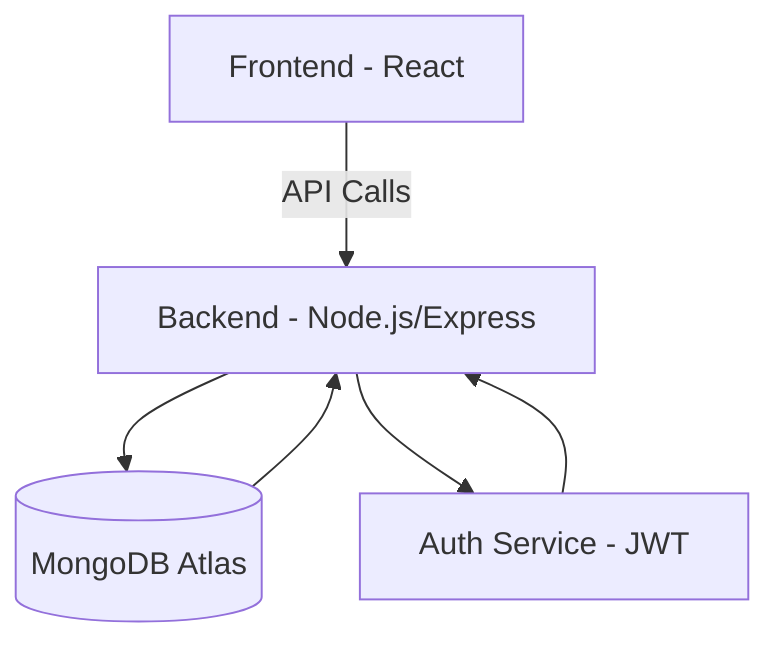

# Social Media Post Creator

## Overview

The _Social Media Post Creator_ is a SaaS web application designed to simplify and automate the process of creating social media content.  
It enables users to design posts, generate AI-powered captions and hashtags, compress images, and export content for multiple platforms.  
The project is built entirely on _free and open-source technologies_ with a focus on scalability, accessibility, and real-world production deployment.

---

## Objectives

1. Build a fully functional MERN-based content creation platform.
2. Provide seamless user experience with authentication, post management, and AI-assisted tools.
3. Enable small businesses, creators, and marketers to save time on social media content creation.
4. Create a _One Stop Platform_ that allow users to create, edit and share post multiple social media handles.

---

## Tech Stack

| Layer                | Technology                  | Purpose                                     | Reason for Choice                          |
| -------------------- | --------------------------- | ------------------------------------------- | ------------------------------------------ |
| _Frontend_           | React.js, Tailwind CSS      | UI development                              | Component-based, scalable, responsive      |
| _Backend_            | Node.js, Express.js         | API, authentication, core business logic    | Lightweight, high-performance, widely used |
| _Database_           | MongoDB Atlas               | Store user profiles, posts, scheduling data | Cloud-hosted, scalable, free tier          |
| _Authentication_     | JWT (JSON Web Tokens)       | Token-based authentication for users        | Stateless, secure, widely supported        |
| _Hosting (Backend)_  | Render                      | Deploy backend server                       | Free hosting with auto-deploy              |
| _Hosting (Frontend)_ | Vercel or Netlify (Planned) | Deploy frontend app                         | Easy CI/CD integration                     |
| _Image Processing_   | Sharp (Planned)             | Compress and optimize media uploads         | Popular, free, easy to integrate           |
| _AI Captioning_      | OpenAI or Hugging Face APIs | Generate captions and hashtags              | Leverages free-tier AI APIs                |
| _Version Control_    | Git, GitHub                 | Code versioning and collaboration           | Industry standard                          |
| _Testing Tools_      | Postman, Jest (Future)      | API testing and unit tests                  | Reliable developer workflow                |

---

## Features

### ✅ Completed

- _Authentication:_
  - User registration, login, logout using JWT.
  - Middleware-based authentication for protected routes.
- _Posts CRUD:_
  - Create, read, update, and delete posts.
  - User-specific post management.
- _Backend Hosting:_
  - Backend deployed on Render with auto-deploy from GitHub.

---

### 🚧 In Progress

- _Frontend Development:_
  - React frontend with Tailwind CSS and Axios integration.
  - Dashboard and Post creation UI.
- _User Profile Management:_
  - Editable user profile and settings.

---

### 🔜 Planned Features

- _Image Compression:_ Optimize images during upload.
- _AI-Generated Captions:_ Integration with free AI APIs for caption & hashtag suggestions.
- _Content Calendar:_ Drag-and-drop post scheduling.
- _Export Options:_ Download content in image, PDF, or shareable format.
- _Analytics:_ Insights on content engagement (future scope).
- _Social Platform Integrations:_ Direct posting to Instagram, Facebook, etc.

---

## Project Phases

| Phase                    | Description                                                    | Deliverables                                        | Status       |
| ------------------------ | -------------------------------------------------------------- | --------------------------------------------------- | ------------ |
| _Phase 1: Planning_      | Define scope, goals, tech stack, architecture.                 | Project roadmap, wireframes, architecture diagrams. | ✅ Completed |
| _Phase 2: Backend Setup_ | Setup Express server, routes, authentication, database schema. | CRUD APIs, JWT middleware, MongoDB integration.     | ✅ Completed |
| _Phase 3: Frontend UI_   | Build UI with React, Tailwind; integrate with backend APIs.    | Login/register UI, dashboard, post creation page.   | 🚧 Ongoing   |
| _Phase 4: Features_      | Implement image compression, AI captions, export features.     | Sharp integration, AI API setup, PDF/image export.  | 🚧 Pending   |
| _Phase 5: Calendar_      | Add drag-and-drop content calendar for scheduling.             | Calendar UI and scheduling backend APIs.            | 🚧 Pending   |
| _Phase 6: Testing_       | End-to-end testing, bug fixes, performance optimization.       | Jest tests, Postman collection, bug reports.        | 🚧 Pending   |
| _Phase 7: Deployment_    | Deploy frontend and backend, connect to custom domain.         | Live, production-ready app.                         | 🚧 Pending   |
| _Phase 8: Scaling_       | Add analytics, integrations, and advanced features.            | Analytics dashboard, social API integrations.       | 🚧 Future    |

---

## API Endpoints

### Base URL : https://postmux.onrender.com/api/v1

### User Routes

| Method | Endpoint             | Description          | Auth |
| ------ | -------------------- | -------------------- | ---- |
| POST   | /users/new    | Register a new user         | ❌   |
| POST   | /users/login  | Login and get access token  | ❌   |
| GET    | /users/me     | Get logged-in user profile  | ✅   |
| POST   | /users/logout | Logout and invalidate token | ✅   |

### Post Routes

| Method | Endpoint          | Description     | Auth |
| ------ | ----------------- | ----------------| ---- |
| POST   | /posts/new | Create a new post      | ✅   |
| GET    | /posts/all | Get all posts for user | ✅   |
| GET    | /posts/:id | Get post by ID         | ✅   |
| PUT    | /posts/:id | Update post by ID      | ✅   |
| DELETE | /posts/:id | Delete post by ID      | ✅   |

---

# PostMux Development Plan

## Phase 1: Planning & Requirements
### Requirements
- **Core Features**:  
  - Post creation and editing  
  - AI-generated captions using free APIs  
  - Image compression before upload/export  
  - Export/download posts (image or file format)  
  - Simple content calendar for scheduling  
- **Non-Functional**:  
  - Responsive UI (mobile + desktop)  
  - Secure authentication (JWT)  
  - Free, beginner-friendly tools/libraries  

### Approach
- Finalize feature list based on target audience.  
- Create wireframes for UI/UX flow (Figma or Draw.io).  
- Decide API endpoints, database schema, and component hierarchy.  

---

## Phase 2: Backend Setup
### Requirements
- **Tech Stack**: Node.js, Express.js, MongoDB.  
- Configure environment variables for API keys.  
- Set up user authentication (register, login, logout).  
- CRUD operations for posts and calendar entries.  
- Error handling middleware for all controllers.  

### Approach
- Initialize project with `npm init`.  
- Create folder structure: `/controllers`, `/routes`, `/models`, `/middleware`.  
- Design MongoDB schemas:  
  - **User**: username, email, hashed password.  
  - **Post**: title, content, image URL, AI caption, createdBy, createdAt.  
  - **Calendar**: postId, scheduledDate, userId.  
- Implement JWT auth middleware for protected routes.  
- Integrate AI caption generation API in a dedicated controller.  

---

## Phase 3: Frontend Setup
### Requirements
- **Tech Stack**: React (with Tailwind CSS pre-configured).  
- Pages: Login/Register, Dashboard, Post Editor, Calendar, Export/Download.  
- State management: Context API or Redux (optional).  

### Approach
- Initialize project with `create-react-app` or Vite.  
- Organize folders: `/components`, `/pages`, `/hooks`, `/services`.  
- Create reusable components:  
  - Post editor (text + image uploader)  
  - Image compressor UI  
  - Caption generator panel  
  - Calendar view  
- Implement routing with `react-router-dom`.  
- Connect to backend using Axios or Fetch API.  

---

## Phase 4: AI Caption & Image Compression Integration
### Requirements
- Integrate free AI caption generation API (e.g., OpenAI free alternatives or Hugging Face spaces).  
- Implement client-side image compression using libraries like `browser-image-compression`.  

### Approach
- Backend: Create a proxy endpoint to securely call AI caption APIs.  
- Frontend: Build a caption generator section that requests captions from backend.  
- Frontend: Compress images before sending them to backend to reduce load.  

---

## Phase 5: Export & Content Calendar
### Requirements
- Allow exporting posts as images or downloadable formats (e.g., PNG or PDF).  
- Build a simple content calendar for scheduling and viewing upcoming posts.  

### Approach
- Backend:  
  - Add endpoints for saving scheduled posts.  
  - Store scheduledDate and related metadata in MongoDB.  
- Frontend:  
  - Use a library like `react-calendar` to render scheduled posts.  
  - Add buttons for export/download using `html-to-image` or `jspdf`.  

---

## Phase 6: Testing & Optimization
### Requirements
- Unit tests for backend routes and controllers.  
- Frontend testing for major components and API calls.  
- Performance optimization for large images and multiple posts.  

### Approach
- Use Jest and Supertest for backend tests.  
- Use React Testing Library for frontend tests.  
- Test API error handling and edge cases.  
- Profile and optimize API response times and bundle sizes.  

---

## Phase 7: Deployment & Documentation
### Requirements
- Deploy backend (e.g., Render or Railway).  
- Deploy frontend (e.g., Vercel or Netlify).  
- Create a production `.env` configuration for API keys and URLs.  
- Write detailed README with setup and usage instructions.  

### Approach
- Use Git for version control with feature-based commits.  
- Configure CORS and HTTPS for production.  
- Include screenshots and sample data in documentation.  

---

## Phase 8: Future Enhancements
### Ideas
- Direct posting to social media platforms.  
- Advanced analytics (likes, shares, engagement).  
- Collaborative features (teams, shared calendars).  
- Premium tier with enhanced AI features.  

### Approach
- Gather user feedback post-launch.  
- Research APIs and SDKs for direct posting (e.g., Meta Graph API).  
- Incrementally add analytics dashboards with Recharts or Chart.js.

---

## System Architecture

