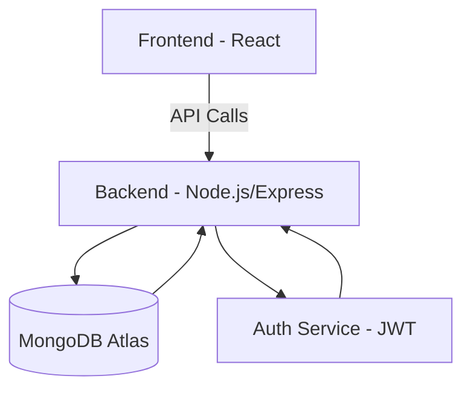

# Social Media Post Creator

## Overview

The _Social Media Post Creator_ is a SaaS web application designed to simplify and automate the process of creating social media content.  
It enables users to design posts, generate AI-powered captions and hashtags, compress images, and export content for multiple platforms.  
The project is built entirely on _free and open-source technologies_ with a focus on scalability, accessibility, and real-world production deployment.

---

## Objectives

1. Build a fully functional MERN-based content creation platform.
2. Provide seamless user experience with authentication, post management, and AI-assisted tools.
3. Enable small businesses, creators, and marketers to save time on social media content creation.
4. Create a _One Stop Platform_ that allow users to create, edit and share post multiple social media handles.

---

## Tech Stack

| Layer                | Technology                  | Purpose                                     | Reason for Choice                          |
| -------------------- | --------------------------- | ------------------------------------------- | ------------------------------------------ |
| _Frontend_           | React.js, Tailwind CSS      | UI development                              | Component-based, scalable, responsive      |
| _Backend_            | Node.js, Express.js         | API, authentication, core business logic    | Lightweight, high-performance, widely used |
| _Database_           | MongoDB Atlas               | Store user profiles, posts, scheduling data | Cloud-hosted, scalable, free tier          |
| _Authentication_     | JWT (JSON Web Tokens)       | Token-based authentication for users        | Stateless, secure, widely supported        |
| _Hosting (Backend)_  | Render                      | Deploy backend server                       | Free hosting with auto-deploy              |
| _Hosting (Frontend)_ | Vercel or Netlify (Planned) | Deploy frontend app                         | Easy CI/CD integration                     |
| _Image Processing_   | Sharp (Planned)             | Compress and optimize media uploads         | Popular, free, easy to integrate           |
| _AI Captioning_      | OpenAI or Hugging Face APIs | Generate captions and hashtags              | Leverages free-tier AI APIs                |
| _Version Control_    | Git, GitHub                 | Code versioning and collaboration           | Industry standard                          |
| _Testing Tools_      | Postman, Jest (Future)      | API testing and unit tests                  | Reliable developer workflow                |

---

## Features

### ✅ Completed

- _Authentication:_
  - User registration, login, logout using JWT.
  - Middleware-based authentication for protected routes.
- _Posts CRUD:_
  - Create, read, update, and delete posts.
  - User-specific post management.
- _Backend Hosting:_
  - Backend deployed on Render with auto-deploy from GitHub.

---

### 🚧 In Progress

- _Frontend Development:_
  - React frontend with Tailwind CSS and Axios integration.
  - Dashboard and Post creation UI.
- _User Profile Management:_
  - Editable user profile and settings.

---

### 🔜 Planned Features

- _Image Compression:_ Optimize images during upload.
- _AI-Generated Captions:_ Integration with free AI APIs for caption & hashtag suggestions.
- _Content Calendar:_ Drag-and-drop post scheduling.
- _Export Options:_ Download content in image, PDF, or shareable format.
- _Analytics:_ Insights on content engagement (future scope).
- _Social Platform Integrations:_ Direct posting to Instagram, Facebook, etc.

---

## Project Phases

| Phase                    | Description                                                    | Deliverables                                        | Status       |
| ------------------------ | -------------------------------------------------------------- | --------------------------------------------------- | ------------ |
| _Phase 1: Planning_      | Define scope, goals, tech stack, architecture.                 | Project roadmap, wireframes, architecture diagrams. | ✅ Completed |
| _Phase 2: Backend Setup_ | Setup Express server, routes, authentication, database schema. | CRUD APIs, JWT middleware, MongoDB integration.     | ✅ Completed |
| _Phase 3: Frontend UI_   | Build UI with React, Tailwind; integrate with backend APIs.    | Login/register UI, dashboard, post creation page.   | 🚧 Ongoing   |
| _Phase 4: Features_      | Implement image compression, AI captions, export features.     | Sharp integration, AI API setup, PDF/image export.  | 🚧 Pending   |
| _Phase 5: Calendar_      | Add drag-and-drop content calendar for scheduling.             | Calendar UI and scheduling backend APIs.            | 🚧 Pending   |
| _Phase 6: Testing_       | End-to-end testing, bug fixes, performance optimization.       | Jest tests, Postman collection, bug reports.        | 🚧 Pending   |
| _Phase 7: Deployment_    | Deploy frontend and backend, connect to custom domain.         | Live, production-ready app.                         | 🚧 Pending   |
| _Phase 8: Scaling_       | Add analytics, integrations, and advanced features.            | Analytics dashboard, social API integrations.       | 🚧 Future    |

---

## API Endpoints

### User Routes

| Method | Endpoint             | Description                 | Auth |
| ------ | -------------------- | --------------------------- | ---- |
| POST   | /api/v1/users/new    | Register a new user         | ❌   |
| POST   | /api/v1/users/login  | Login and get access token  | ❌   |
| GET    | /api/v1/users/me     | Get logged-in user profile  | ✅   |
| POST   | /api/v1/users/logout | Logout and invalidate token | ✅   |

### Post Routes

| Method | Endpoint          | Description            | Auth |
| ------ | ----------------- | ---------------------- | ---- |
| POST   | /api/v1/posts/new | Create a new post      | ✅   |
| GET    | /api/v1/posts/all | Get all posts for user | ✅   |
| GET    | /api/v1/posts/:id | Get post by ID         | ✅   |
| PUT    | /api/v1/posts/:id | Update post by ID      | ✅   |
| DELETE | /api/v1/posts/:id | Delete post by ID      | ✅   |

---

## System Architecture

